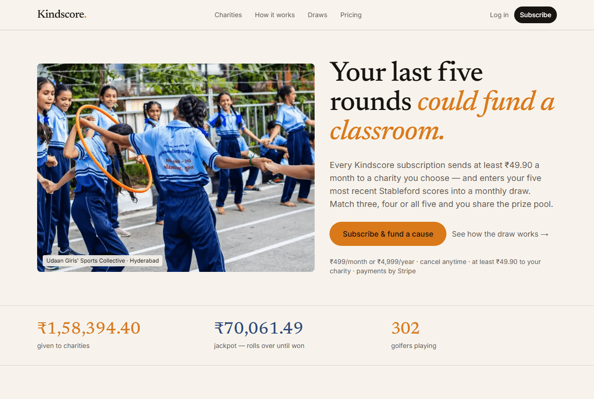
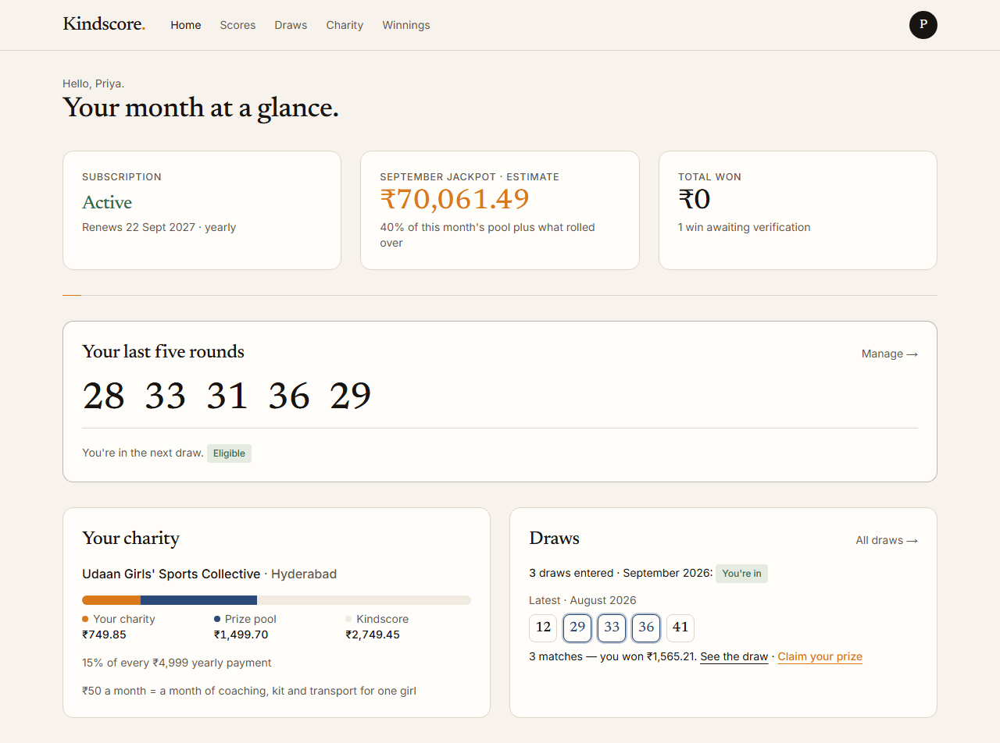
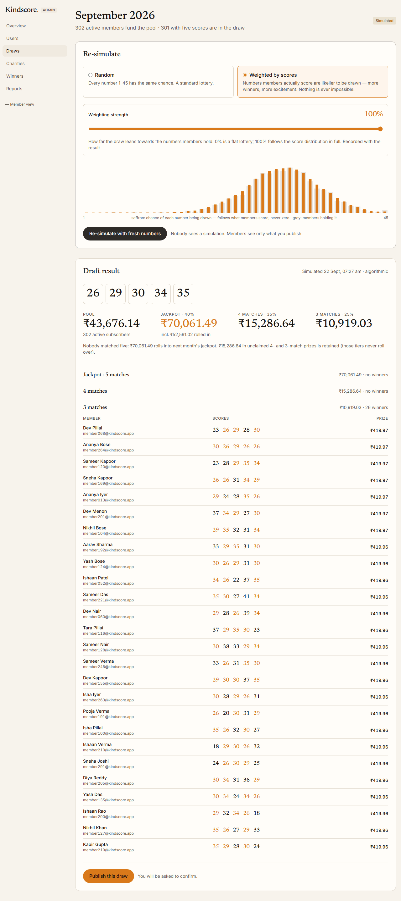
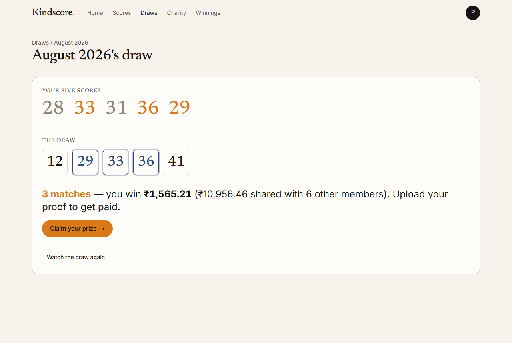
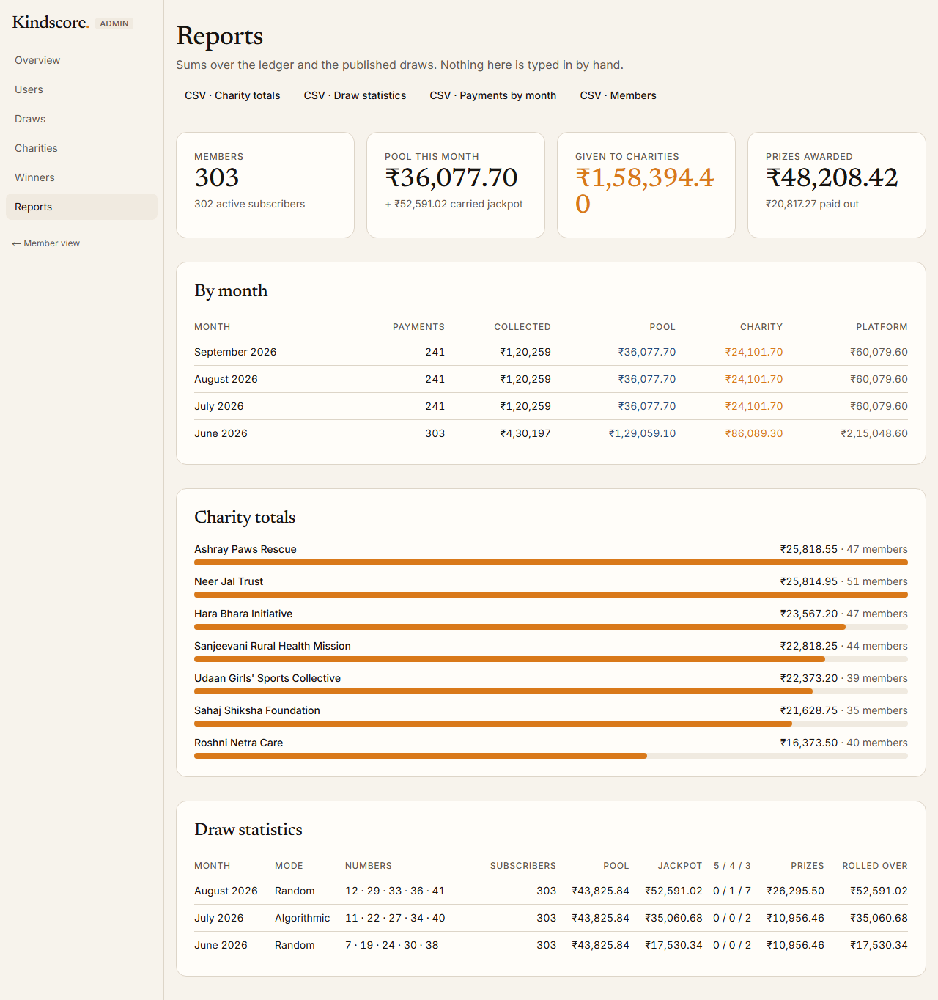
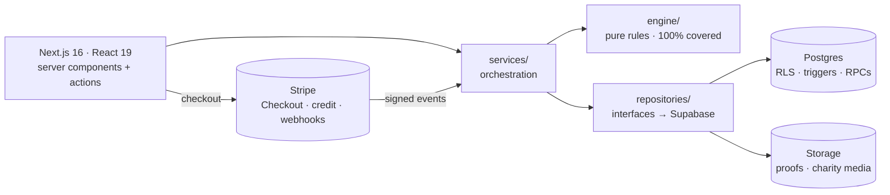
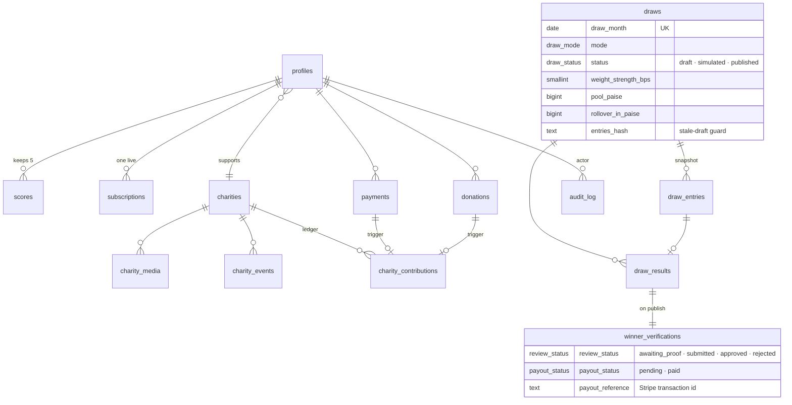

<div align="center">

# Kindscore.

**Give every month. Win some months.**

A charity lottery for golfers. Your last five Stableford scores are your lottery numbers,
and at least 10% of every fee goes to a charity you choose.

[](https://kindscore.vercel.app)
[](docs/TESTING.md)
[](docs/GAME.md)




</div>

## Try it in a minute

**https://kindscore.vercel.app** · password for every account `Kindscore!2026` · test card `4242 4242 4242 4242`

| Log in as             | You get                                                                    |
| --------------------- | -------------------------------------------------------------------------- |
| `admin@kindscore.app` | The admin panel — September's draw is open for you to simulate and publish |
| `priya@kindscore.app` | An active member with a 3-match win from August waiting to be claimed      |
| `raj@kindscore.app`   | A member with three scores — not yet in the draw                           |
| `anita@kindscore.app` | A lapsed member — scores kept, draw locked, one win already paid           |
| _your own signup_     | The real Stripe checkout                                                   |

Three months of draws were generated by the real engine at seed time; the jackpot has rolled over each month and stands at **₹52,591** for September. The step-by-step script is [`docs/TESTING.md`](docs/TESTING.md).

## What it does

|                   **Play**                    |                          **Give**                           |                           **Run**                           |
| :-------------------------------------------: | :---------------------------------------------------------: | :---------------------------------------------------------: |
|  Log your last five Stableford scores (1–45)  |  Pick a charity at signup; 10–70% of every fee goes to it   |       Simulate the monthly draw as often as you like        |
|  A sixth score replaces the oldest, by date   |  Change charity or share any time — from the next payment   |     Random, or weighted by what golfers actually score      |
| Once a month five numbers are drawn from 1–45 |           One-off donations, not tied to the game           |       Publish once; a stale draft can't be published        |
| Match 3, 4 or 5 → share 25 / 35 / 40% of pool | Directory with search, filters, profiles, events, spotlight | Verify winners' screenshots; approve or reject with reason  |
|    Unclaimed jackpot rolls over and grows     |      Every rupee is a ledger row, never a stored total      | Users, subscriptions, charities, reports, CSV — all audited |
|   Winner claims the prize → paid via Stripe   |                                                             |                                                             |

<div align="center">
<table>
  <tr>
    <td></td>
    <td></td>
  </tr>
  <tr>
    <td align="center"><sub>Member dashboard — every PRD §10 module, live from the ledger</sub></td>
    <td align="center"><sub>Admin draw — weighted mode, strength dial, draft report</sub></td>
  </tr>
  <tr>
    <td></td>
    <td></td>
  </tr>
  <tr>
    <td align="center"><sub>The reveal — five tiles roll in, matches light up, claim your prize</sub></td>
    <td align="center"><sub>Reports — totals, months, charities, draws, CSV</sub></td>
  </tr>
</table>
</div>

## How it's built



- **The rules are pure TypeScript** — score window, both draw modes, matching, prize split, rollover, verification state machine, money in paise. No framework imports (ESLint-enforced), 100% line coverage.
- **Services depend on interfaces**, not on Supabase — every service is unit-tested with in-memory fakes, then proven once against a real local Postgres.
- **The database keeps the invariants** whatever the app does: `charity + pool + platform = amount` on every payment, `jackpot + four + three = pool + rollover` on every draw, a trigger-only charity ledger, deny-by-default RLS on all 15 tables, and every state change (simulate, publish, review, claim) a `security definer` RPC that re-checks the rule.
- **Stripe is idempotent by construction** — event-id claim, out-of-order guard, and the success page runs the same sync as the webhook.

<details>
<summary><strong>Data model</strong></summary>



Money is integer paise, percentages are basis points, every split is frozen on its row. Fifteen tables, 41 policies, eight RPCs, three views — all in `supabase/migrations/`.

</details>

## Stack

| Layer    | Choice                                      | Why                                                                          |
| -------- | ------------------------------------------- | ---------------------------------------------------------------------------- |
| Web      | Next.js 16 App Router, React 19, Tailwind 4 | Server components + actions: one codebase, no API layer to keep in sync      |
| Data     | Supabase — Postgres, Auth, Storage, RLS     | Rules enforced at the row level; RPCs for atomic multi-row writes            |
| Payments | Stripe — Checkout, Billing Portal, webhooks | PCI stays with Stripe; monthly ₹499 and yearly ₹4,999; prizes paid as credit |
| Rules    | Pure TypeScript engine, Zod 4 at the edges  | Testable without I/O; one definition of every business number                |
| Tests    | Vitest 5 (unit + integration), Playwright   | 466 automated tests plus browser walkthroughs incl. real test-mode checkout  |
| Hosting  | Vercel + a daily keep-alive cron            | New account and new Supabase project, as the brief requires                  |

## Run it locally

```bash
pnpm install
cp .env.example .env.local     # Supabase + Stripe test keys — see the table in .env.example
pnpm db:start                  # local Postgres / Auth / Storage (Docker)
pnpm db:reset                  # migrations + the seven charities
pnpm stripe:setup              # creates the two INR prices, prints STRIPE_PRICE_*
pnpm seed                      # demo accounts, 300 members, four months of payments, three draws
pnpm dev                       # http://localhost:3000
```

Tests: `pnpm test` (unit) · `pnpm test:int` (integration, local Supabase) · `pnpm test:coverage`. Browser walkthroughs live in `scripts/walkthroughs/` and run against `pnpm build && pnpm start`.

<details>
<summary><strong>Deploying</strong> (new Supabase project + new Vercel account)</summary>

1. **Supabase** — create a project, `pnpm exec supabase link`, `pnpm db:push`, run `supabase/seed.sql`. Auth → Email: confirm-email **off**. Auth → URL configuration: site URL + `<url>/auth/callback`.
2. **Vercel** — import the repo, add the variables from `.env.example` (production values), deploy. `vercel.json` schedules the keep-alive cron.
3. **Stripe** — `pnpm stripe:setup --webhook https://<app>` prints `STRIPE_WEBHOOK_SECRET`; add it and redeploy.
4. **Seed** — `pnpm seed --env .env.cloud.local --yes`.

</details>

## Where the PRD was silent

Every ambiguity and the choice we made is marked `[decision]` in [`docs/GAME.md`](docs/GAME.md) — 36 of them. The ones that shape the product:

- **What gets matched** — the drawn numbers are compared with the member's five scores; it is the only reading where every PRD sentence fits.
- **Pool share is 30%, charity share 10–70%** — the pool takes its fixed cut first, so 70% is the most a charity can receive; at 70% Kindscore keeps nothing.
- **Weighted mode smooths the tally and keeps a floor** — the draw follows how golfers score, and no number is ever impossible. The admin sets the strength.
- **A stale draft cannot be published** — if any eligible score or the funding base changes after a simulation, publish is blocked until you re-simulate.
- **Winners claim their own payout** — credited to their Stripe customer as subscription credit, verified by Stripe's transaction id. No human marks anything paid.
- **Restricted access is a locked shell, not a lockout** — a lapsed member still sees their charity, the jackpot and their history; scores and the draw wait for renewal.

<details>
<summary><strong>Known limits &amp; what comes next</strong></summary>

- Prizes are subscription credit, not cash: Stripe cannot pay an Indian individual from this US-registered sandbox. A cash rail (RazorpayX) is another `PayoutGateway` implementation.
- No email notifications — the dashboard is the notification.
- Mobile Lighthouse performance is 82 (the photo-led hero on simulated slow 4G); desktop is 98.
- At 100× scale: the draw becomes a queued job, the report views become materialised, admin lists paginate in SQL. The engine, the interfaces and the invariants would not change.

</details>

## Repository

```
src/engine/        pure rules — scores · draw · prizes · charity split · verification · money
src/services/      orchestration over engine + repositories
src/repositories/  interfaces + Supabase implementations
src/lib/           Supabase clients · auth guards · Stripe gateways · webhook pipeline
src/app/           (marketing) · (auth) · (member)/app · (admin)/admin · api/
supabase/          15 migrations · seed.sql
tests/             unit (mirrors src) · integration (real Postgres) · fakes · fixtures
scripts/           seed.ts · stripe-setup.ts · walkthroughs/ (Playwright)
docs/              GAME.md · TESTING.md · screenshots/
```

<sub>Built for the Digital Heroes Level 1 PRD. Photography: Unsplash and Pexels. Charities are fictional.</sub>
