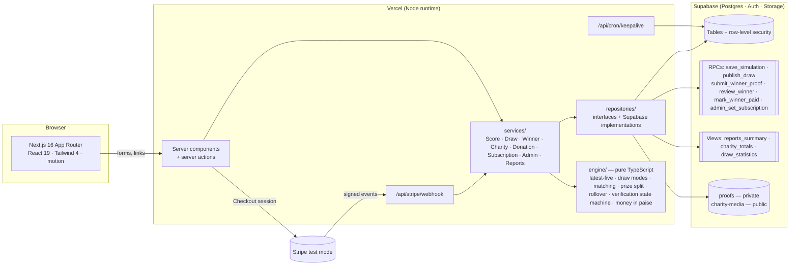
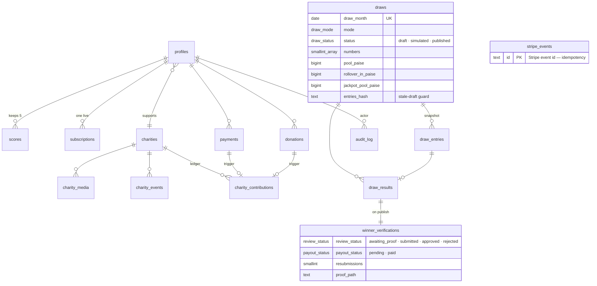

# Kindscore — a charity lottery for golfers

**Give every month. Win some months.** Subscribers direct at least 10% of their fee to a charity they choose and log their last five Stableford scores. Once a month, five numbers from 1 to 45 are drawn; match three, four or all five and you share the prize pool. Built for the Digital Heroes Level 1 PRD.

|                        |                                                                                          |
| ---------------------- | ---------------------------------------------------------------------------------------- |
| **Live site**          | `<LIVE_URL>`                                                                             |
| **Repository**         | `https://github.com/abrasive519mars/kindscore`                                           |
| **Evaluator script**   | [`docs/TESTING.md`](docs/TESTING.md) — ten minutes, every PRD §16.1 step                 |
| **How the game works** | [`docs/GAME.md`](docs/GAME.md) — the rules in plain language, with every decision marked |

## Demo accounts

All passwords: `Kindscore!2026`. Payments are Stripe **test mode**: card `4242 4242 4242 4242`, any future expiry, any CVC, any Indian address.

| Account                   | What it shows                                                                                                 |
| ------------------------- | ------------------------------------------------------------------------------------------------------------- |
| `admin@kindscore.app`     | The admin panel: users, draws (September is open and unsimulated — run it), charities, winners queue, reports |
| `priya@kindscore.app`     | An active yearly member with five scores, a **3-match win in August awaiting her proof**                      |
| `raj@kindscore.app`       | An active member with three scores — not yet eligible; the dashboard says what to do                          |
| `anita@kindscore.app`     | A **lapsed** member: scores kept, locked out of the draw, one June win already paid                           |
| `member012@kindscore.app` | A proof **submitted** and waiting for the admin                                                               |
| `member017@kindscore.app` | A 4-match win, approved and **paid**                                                                          |

Three months of draws (June, July, August 2026) were generated by the real draw engine at seed time; the jackpot has rolled over each month and stands at ₹52,591 for September.

## Features, by PRD section

| PRD                  | What Kindscore does                                                                                                                                                                                                                                                                                                                                                                                                           |
| -------------------- | ----------------------------------------------------------------------------------------------------------------------------------------------------------------------------------------------------------------------------------------------------------------------------------------------------------------------------------------------------------------------------------------------------------------------------- |
| §04 Subscriptions    | Stripe Checkout, monthly ₹499 / yearly ₹4,999 (INR, GST inclusive). Webhook mirror with signature check, event-id idempotency and an out-of-order guard; the success page runs the same sync so a dev box without a webhook is consistent. Cancel keeps access to period end and is resumable; a failed renewal restricts on the next request. Every authenticated request checks the mirror — nothing is cached per session. |
| §05 Scores           | Latest five by _date played_ (a sixth replaces the oldest, enforced by a database trigger and the engine), one round per date, 1–45, no future dates, backdated-beyond-window refused, inline edit/delete with an animated list.                                                                                                                                                                                              |
| §06 Draw             | Monthly. Two modes: random, or weighted by what golfers actually score (count → smooth → floor, so nothing is impossible). Admin simulates as often as needed, sees every winner and rupee, then publishes once; a draft goes stale if any eligible member's scores change. Members get a reveal; visitors see the history.                                                                                                   |
| §07 Prize pool       | Every active subscriber funds the pool (30% of their fee, a yearly fee spread over twelve draws). 40 / 35 / 25 across 5 / 4 / 3 matches, equal split to the paisa, jackpot-only rollover, unclaimed lower tiers retained and reported.                                                                                                                                                                                        |
| §08 Charity          | Chosen at signup, 10–70% in 5% steps, changeable from the next payment; the split is frozen on every payment. One-off donations through Stripe. Directory with search and cause/city filters, profile pages with story, photos, upcoming events and ledger totals, homepage spotlight.                                                                                                                                        |
| §09 Verification     | Winners upload one screenshot (private bucket, signed URLs); admin approves or rejects with a reason (one resubmission); the winner then **claims** the payout — credited to their Stripe customer as subscription credit, verified by Stripe's transaction id, Pending → Paid with no human step.                                                                                                                            |
| §10 Member dashboard | Subscription state and renewal date, five scores, charity and share, draws entered and next-draw eligibility, total won and payment status.                                                                                                                                                                                                                                                                                   |
| §11 Admin            | Users (search, edit profile / scores / subscription — every edit audited), draws (simulate → publish), charities (CRUD, cover + gallery uploads, events, spotlight, soft-delete), winners queue, reports (members, pool, charity totals, draw statistics, CSV).                                                                                                                                                               |
| §12 UI/UX            | "Feel, not fairway": an ivory/ink editorial system with one saffron accent that always means _the charity's share_; photography of people, never golf. Motion budget of a few once-only moments (score eviction, match fill, draw reveal, jackpot odometer). Lighthouse on `/`: desktop 98 / 100 / 100 / 100.                                                                                                                 |

## Architecture



**Where the rules live.** Everything that decides money or fairness is a pure function in `src/engine/` (100% line coverage, no framework imports — an ESLint rule enforces it). Services orchestrate engine + repositories; repositories are interfaces with Supabase implementations, so every service is unit-tested with in-memory fakes and then proven once against a real local Postgres. Multi-row writes that must be atomic (simulate, publish, the verification transitions, admin subscription control) are `security definer` RPCs that re-check the same rules. The service-role key is used only by the Stripe webhook and the seed; app code runs on the caller's own session and RLS decides what it may see.

## Data model



Money is stored as integer paise (`bigint`) and percentages as basis points; the three-way split of every payment is frozen on the row (`check (charity + pool + platform = amount)`), and the `charity_contributions` ledger is written only by triggers. Fifteen tables, 41 RLS policies, eight RPCs, three views — all in `supabase/migrations/`.

**Three things the database guarantees whatever the application does:**

1. **Money is conserved.** Every payment row satisfies `charity + pool + platform = amount`; every draw row satisfies `jackpot + four + three = pool + rollover_in` and `rollover_out ∈ {0, jackpot}`; the charity ledger has exactly one row per payment or paid donation, written by triggers, never by code.
2. **Nothing is visible before it is published.** Draws, entries and results carry row-level policies that hide anything but `published`; the public statistics view filters the same way. A simulation is invisible to members at the SQL level, not only in the UI.
3. **Every state change is a transaction with a rule check.** Simulate, publish, submit proof, review, claim, record payout and grant/end subscription are `security definer` RPCs that re-check the state machine and the caller's role, so two tabs, a replayed webhook or a hand-crafted request cannot skip a step.

## Tech stack

Next.js 16.3 (App Router, server actions, Turbopack) · React 19 · TypeScript 5 · Tailwind CSS 4 · motion · Supabase (Postgres, Auth, Storage, RLS) via `@supabase/ssr` · Stripe (Checkout, Billing Portal, webhooks) · Zod 4 · Vitest 5 · Playwright (browser walkthroughs) · pnpm 12 · Vercel.

## Local setup

Prerequisites: Node 22, pnpm 12, Docker Desktop (for the local Supabase stack), a Stripe test-mode account.

```bash
pnpm install
cp .env.example .env.local              # fill in the values below
pnpm db:start                           # local Postgres + Auth + Storage in Docker
pnpm db:reset                           # apply every migration + the seven charities
pnpm stripe:setup                       # creates the two INR prices, prints STRIPE_PRICE_*
pnpm seed                               # demo accounts, 300 members, 4 months of payments, 3 draws
pnpm dev                                # http://localhost:3000
```

| Variable                                                    | Where it comes from                                                                                                      | Public?      |
| ----------------------------------------------------------- | ------------------------------------------------------------------------------------------------------------------------ | ------------ |
| `NEXT_PUBLIC_SUPABASE_URL`, `NEXT_PUBLIC_SUPABASE_ANON_KEY` | Supabase → Project Settings → API (local: printed by `pnpm db:start`)                                                    | yes          |
| `SUPABASE_SERVICE_ROLE_KEY`                                 | Same page. Used only by the webhook, the cron and `pnpm seed`                                                            | **no**       |
| `STRIPE_SECRET_KEY`, `NEXT_PUBLIC_STRIPE_PUBLISHABLE_KEY`   | Stripe → Developers → API keys (test mode)                                                                               | secret / yes |
| `STRIPE_PRICE_MONTHLY`, `STRIPE_PRICE_YEARLY`               | Printed by `pnpm stripe:setup`                                                                                           | no           |
| `STRIPE_WEBHOOK_SECRET`                                     | `pnpm stripe:setup --webhook https://<app>`; locally any `whsec_` placeholder — the success page syncs without a webhook | no           |
| `NEXT_PUBLIC_APP_URL`                                       | The site's own origin (Stripe redirects back to it)                                                                      | yes          |
| `CRON_SECRET`                                               | Any random string; Vercel sends it to `/api/cron/keepalive`                                                              | no           |
| `SEED_PASSWORD`                                             | Password given to every seeded account (default `Kindscore!2026`)                                                        | no           |
| `NEXT_PUBLIC_DEMO_ACCOUNTS`                                 | `1` to show the demo-accounts panel on `/login?demo=1`                                                                   | yes          |

Integration tests run against the local stack (`.env.test` holds the CLI's well-known demo keys).

## Deployment (new Supabase project + new Vercel account, per PRD §15)

1. **Supabase** — create a project (ap-south-1). `pnpm exec supabase link`, `pnpm db:push`, `pnpm exec supabase db query --linked --file supabase/seed.sql`. Authentication → Providers → Email: turn **Confirm email off**. Authentication → URL Configuration: Site URL = the Vercel URL, Redirect URLs += `<url>/auth/callback`.
2. **Stripe** (test mode) — `pnpm stripe:setup` once for the prices; after the first deploy `pnpm stripe:setup --webhook https://<app>` prints `STRIPE_WEBHOOK_SECRET`.
3. **Vercel** — import the repository, add every variable from the table above (production values), deploy. `vercel.json` schedules the daily keep-alive cron. Redeploy after adding the webhook secret.
4. **Seed** — `pnpm seed --env .env.cloud.local --yes` (a git-ignored file with the project's keys).

## Scripts

`dev` · `build` · `start` · `lint` · `typecheck` · `format` · `test` (unit) · `test:int` (integration, local Supabase) · `test:coverage` · `db:start` · `db:reset` · `db:push` · `db:types` · `seed` · `stripe:setup` · `docs:build` (decisions table, diagrams, PDF) · `package` (submission zip). Browser walkthroughs per phase live in `scripts/walkthroughs/` and run against a started build.

## Testing

| Layer                  | What it proves                                                                                                                                                                                                                       | Run                                        |
| ---------------------- | ------------------------------------------------------------------------------------------------------------------------------------------------------------------------------------------------------------------------------------ | ------------------------------------------ |
| Unit — 356 tests       | The engine (100% lines: score window, both draw modes ×1000, matching, tier split exactness, rollover chain, verification state machine, money) and every service against in-memory fakes                                            | `pnpm test`                                |
| Integration — 87 tests | RLS as anon / member / admin, the rolling-five trigger, the ledger trigger, the draw RPCs, the Stripe webhook with signed fixture events, a real proof upload, donations, admin control, report sums — against a real local Postgres | `pnpm test:int`                            |
| Walkthroughs           | Playwright drives each phase's flow in a real browser, including real Stripe test-mode Checkout, and captures screenshots                                                                                                            | `pnpm tsx scripts/walkthroughs/<phase>.ts` |
| Lighthouse             | `/` desktop 98 / 100 / 100 / 100; mobile 82 / 100 / 100 / 100 (simulated slow 4G; the hero photo)                                                                                                                                    | in `phase10-landing.ts`                    |

[`docs/TESTING.md`](docs/TESTING.md) is the evaluator's script: twelve one-line steps in PRD §16.1 order, each with what you should see.

## Decisions — where the PRD was silent

Generated from the `[decision]` markers in [`docs/GAME.md`](docs/GAME.md) by `pnpm docs:build`, so this table cannot drift from the rules the code enforces.

<!-- decisions:start -->

| #   | Where                                           | Decision                                                                                                                                                                                                                                                                                                           |
| --- | ----------------------------------------------- | ------------------------------------------------------------------------------------------------------------------------------------------------------------------------------------------------------------------------------------------------------------------------------------------------------------------ |
| 1   | 1. Subscribing — where the money comes from     | The ceiling is 70% — because the prize pool always takes its fixed 30% first, 70% is the most that can go to charity; at 70% Kindscore keeps nothing. ·                                                                                                                                                            |
| 2   | 1. Subscribing — where the money comes from     | 30%, kept as a single config constant.                                                                                                                                                                                                                                                                             |
| 3   | 1. Subscribing — where the money comes from     | Donations need an account (signup is free) so every rupee in the ledger belongs to a member and "you have given ₹X" is honest; the minimum is ₹10, whole rupees, capped at ₹1,00,000 per transaction as a sanity limit.                                                                                            |
| 4   | 1. Subscribing — where the money comes from     | Exactly one charity is the homepage spotlight; featuring another un-features the last.                                                                                                                                                                                                                             |
| 5   | 1. Subscribing — where the money comes from     | Charities are never hard-deleted — "Hide" removes one from the directory and signup while existing supporters keep contributing until they change, and the admin sees how many that is before hiding.                                                                                                              |
| 6   | 1. Subscribing — where the money comes from     | Lapsed and ended subscriptions stay visible: the app reads a member's latest subscription whatever its status, so "your subscription has lapsed" is shown rather than "never subscribed".                                                                                                                          |
| 7   | 1. Subscribing — where the money comes from     | Subscribing is two steps — account and charity first, plan and Stripe payment second.                                                                                                                                                                                                                              |
| 8   | 1. Subscribing — where the money comes from     | "Restricted access" means a locked shell, not a lockout: a member without an active subscription still sees the app, their charity and the jackpot, with score entry and draw participation dimmed behind one "Subscribe to unlock" button.                                                                        |
| 9   | 1. Subscribing — where the money comes from     | Signup is one page — name, email, password, charity, percentage — and plan/payment come after the account exists, so an abandoned checkout still leaves a member and the split is seen before money is asked for.                                                                                                  |
| 10  | 2. Entering scores — how you get your numbers   | A score dated earlier than all five kept scores is rejected with a message ("older than your five kept rounds") rather than silently added and immediately dropped.                                                                                                                                                |
| 11  | 2. Entering scores — how you get your numbers   | Dates are calendar dates in India (Asia/Kolkata).                                                                                                                                                                                                                                                                  |
| 12  | 2. Entering scores — how you get your numbers   | Future dates are refused — a round can't have been played tomorrow.                                                                                                                                                                                                                                                |
| 13  | 2. Entering scores — how you get your numbers   | Deleting a round is allowed and immediate (§05: "an existing entry may only be edited or deleted").                                                                                                                                                                                                                |
| 14  | 2. Entering scores — how you get your numbers   | Editing a kept round to any past date is allowed — it stays one of your five; the "older than your five" rule exists to refuse a sixth round that would be evicted on arrival.                                                                                                                                     |
| 15  | 2. Entering scores — how you get your numbers   | Editing a round to a date another kept round already has is refused the same way as adding one — one score per date holds across edits too.                                                                                                                                                                        |
| 16  | 3. The draw — picking the winning numbers       | The PRD never says what "numbers" are matched; since scores are 1–45 and exactly 5 are kept, the only reading where every sentence fits is: drawn numbers are compared to the user's 5 scores.                                                                                                                     |
| 17  | 3. The draw — picking the winning numbers       | The PRD says only "weighted by score frequency"; with a few hundred users the raw tally is noisy (31 might have 9 holders while 30 and 32 have 40 each), and smoothing makes the draw follow the shape of how golfers score rather than one month's sampling accidents.                                            |
| 18  | 3. The draw — picking the winning numbers       | Every number keeps a small baseline chance so nothing is ever impossible to draw; the PRD never says a never-scored number should be excluded.                                                                                                                                                                     |
| 19  | 3. The draw — picking the winning numbers       | The admin sets a weighting strength (0–100%) for algorithmic mode when simulating (§11 "configure draw logic"): the weight of each number is the baseline plus strength × its smoothed frequency, so 0% is flat like random and 100% follows what members score in full.                                           |
| 20  | 5. The prize pool — how much winners get        | The pool is sized from the active subscriber count at draw time (§07 "auto-calculation of each pool tier based on active subscriber count"): each active monthly subscriber contributes ₹149.70 (30% of ₹499); each active yearly subscriber contributes ₹124.97 (30% of ₹4,999 ÷ 12).                             |
| 21  | 6. Jackpot rollover — why the pot grows         | retained by the platform and shown in admin reports).                                                                                                                                                                                                                                                              |
| 22  | 6. Jackpot rollover — why the pot grows         | Rollover is decided by the draw, not by verification: the jackpot carries only when nobody matched five.                                                                                                                                                                                                           |
| 23  | 6. Jackpot rollover — why the pot grows         | A draw can be opened only once its month has begun (calendar time, not just order), so two months can never be drawn in one.                                                                                                                                                                                       |
| 24  | 7. Simulate, then publish — the admin's control | Staleness is checked twice — when the admin opens the draft and again inside Publish — so two tabs or a slow click can never publish a stale result.                                                                                                                                                               |
| 25  | 8. Winner verification and payout               | The winner claims the payout themselves and it is paid as subscription credit through Stripe, verified by Stripe's transaction id — no human marks anything paid.                                                                                                                                                  |
| 26  | 8. Winner verification and payout               | A member who never checked out (a seeded demo account) gets a Stripe customer created at claim time, so the credit is real and waits for their first invoice.                                                                                                                                                      |
| 27  | 9. What each person sees                        | Rupee figures appear only for money actually being paid — an active member sees the split of their own ₹499 or ₹4,999 payment; a non-subscriber sees their percentage and what it will fund once they subscribe.                                                                                                   |
| 28  | 9. What each person sees                        | Admin-granted subscriptions are marked admin and never touch Stripe (support and demos).                                                                                                                                                                                                                           |
| 29  | 9. What each person sees                        | Every admin edit of member data — profile, scores, subscription — is audited with who, what, before and after.                                                                                                                                                                                                     |
| 30  | 9. What each person sees                        | Admins edit scores under the same rules as members (five kept by date, one per date, 1–45).                                                                                                                                                                                                                        |
| 31  | 9. What each person sees                        | Ending a subscription takes effect on the member's next request, because the gate reads the database every time — nothing is cached per session.                                                                                                                                                                   |
| 32  | 9. What each person sees                        | An admin who logs in lands in the admin panel, and the member area shows an Admin tab — the two roles are one account with two front doors.                                                                                                                                                                        |
| 33  | 9. What each person sees                        | The PRD never says results are public, but a lottery whose outcomes are visible only to entrants is not credible; counts are public, identities never.                                                                                                                                                             |
| 34  | 10. The demo world (seed)                       | Demo history is generated, not typed — the seed signs in as the admin and runs the real draw and verification services with a steered random source, so every figure on every page (pool, rollover ladder, charity totals, winners) is internally consistent and September is untouched for the evaluator to draw. |
| 35  | 10. The demo world (seed)                       | Seeded subscriptions are marked seed and never touch Stripe; the evaluator's own signup on the live site is the proof that Stripe works.                                                                                                                                                                           |
| 36  | 10. The demo world (seed)                       | Demo accounts live at @kindscore.app and never receive mail (Supabase Auth refuses reserved TLDs such as .test; confirmation is off).                                                                                                                                                                              |

<!-- decisions:end -->

## §13 / §14 — what changes at 100× scale

The PRD's page on technical and scalability requirements is missing from the PDF, so these are our own commitments. Today: ~300 members, one draw a month. What would break first, and the next move for each:

| Bottleneck                                                                           | Today                                      | At 30 000 members                                                                                                                                                                                                      |
| ------------------------------------------------------------------------------------ | ------------------------------------------ | ---------------------------------------------------------------------------------------------------------------------------------------------------------------------------------------------------------------------- |
| Draw simulation reads every active member's five scores into one process             | one request, ~300 ms                       | Still one request (150 000 rows, chunked reads already in place) but nearing the 60 s function limit → run the simulation as a queued job (Supabase cron + a worker route), store progress, and page the winners table |
| `reports_summary` and `charity_totals` are computed on read                          | milliseconds                               | Materialised views refreshed by the ledger trigger, or a `monthly_totals` table appended per payment                                                                                                                   |
| Member lists and reports fetch everything then filter in TypeScript (`fetchAllRows`) | fine                                       | Move search/filter into SQL (`ilike`, indexed `status`), paginate the admin table, stream the CSV                                                                                                                      |
| Proof screenshots in one private bucket                                              | fine                                       | Unchanged: object storage scales; add a lifecycle rule to delete proofs a year after payout                                                                                                                            |
| One Postgres, Vercel serverless                                                      | fine                                       | Supabase read replicas for the public pages (already ISR-cached for 60 s), connection pooling via Supavisor, a keep-alive cron already prevents free-tier pausing                                                      |
| Stripe webhooks arrive out of order or twice                                         | handled (event id claim + `last_event_at`) | Unchanged: the design is idempotent by construction                                                                                                                                                                    |

What would not change: the pure engine, the repository interfaces (a queue-backed draw is another `DrawRepository`), the money invariants, and the RLS model.

## Known limitations and what comes next

- Prizes are paid as subscription credit through Stripe (a real customer-balance credit in test mode), not as cash: Stripe Connect cross-border payouts exclude India for a US platform and Global Payouts needs Treasury. A cash rail (RazorpayX / Connect) is another `PayoutGateway` implementation.
- Stripe runs in test mode on a US-registered sandbox (Stripe India is invite-only for new accounts); INR works unchanged.
- No email notifications — the dashboard is the notification. Next: a monthly "your numbers vs the draw" mail.
- The jackpot odometer updates on load, not live.
- Mobile Lighthouse performance is 82 (LCP of the photo-led hero on simulated slow 4G); desktop is 98.

## Repository map

```
src/config/        constants.ts — every business number, PRD-cited · env.ts — validated environment
src/engine/        pure rules (scores, draw, prizes, charity split, verification, money, dates)
src/schemas/       Zod schemas shared by forms and actions
src/repositories/  interfaces/ + supabase/ implementations
src/services/      orchestration over engine + repositories
src/lib/           Supabase clients, auth guards, Stripe gateway + webhook pipeline, storage, composition roots
src/app/           (marketing) · (auth) · (member)/app · (admin)/admin · api/
src/components/    ui primitives · nav · draw · charity · winners · landing
supabase/          migrations (12) · seed.sql · config
scripts/           seed.ts · stripe-setup.ts · build-docs.ts · package.ps1 · walkthroughs/
tests/             unit/ (mirrors src) · integration/ · fakes/ · fixtures/
docs/              PRD.md (verbatim) · GAME.md · TESTING.md · specs/ · plans/ (one per phase) · screenshots/
```

Photography: Unsplash and Pexels, credited in [`docs/CREDITS.md`](docs/CREDITS.md). Charities are fictional.
